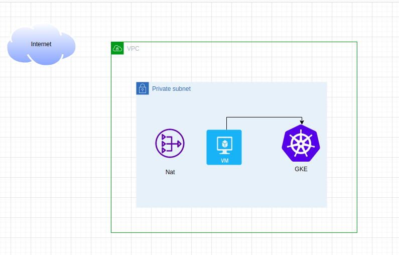

# Demo


## Brief
Provision GCP infrstructure using Terraform , Docker, Kubernetes,Jenkinns.

## Cloning this project
```bash
$ git clone https://github.com/matriix00/terraform-k8s-jenkins.git
```

##  Provision  GCP with Terraform


Install [Terraform](https://developer.hashicorp.com/terraform/tutorials/aws-get-started/install-cli) to build infrastructure as commands below .

```bash
$ terraform init 
$ terraform apply -auto-approve
```

## Play with Kubernetes 
- connect to management-vm
```gcloud compute ssh helper-vm ```

 - copy files into vm from bucket```gsutil cp -r gs://iti-bucket3-gcp/k8s/ . ```
- apply kubectl config 
```sudo apt-get install google-cloud-sdk-gke-gcloud-auth-plugin```
```&&```
```gcloud container clusters get-credentials cluster-jenkins --region europe-west1```
```
$ kubectl apply -f namespaces.yaml
$ kubectl apply -f pv.yaml
$ kubectl apply -f jenkins-service.yaml
$ kubectl apply -f jenkins-deployment.yaml
```
## Clean 
```bash
$ terraform destroy -auto-approve
```
## Contributing
Pull requests are welcome. For major changes, please open an issue first to discuss what you would like to change.

Please make sure to update tests as appropriate.
